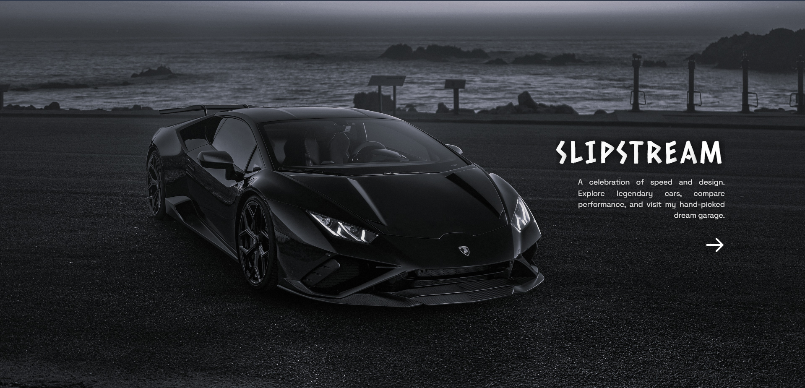
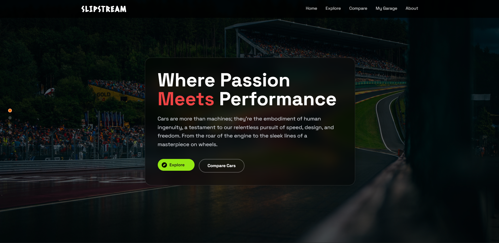
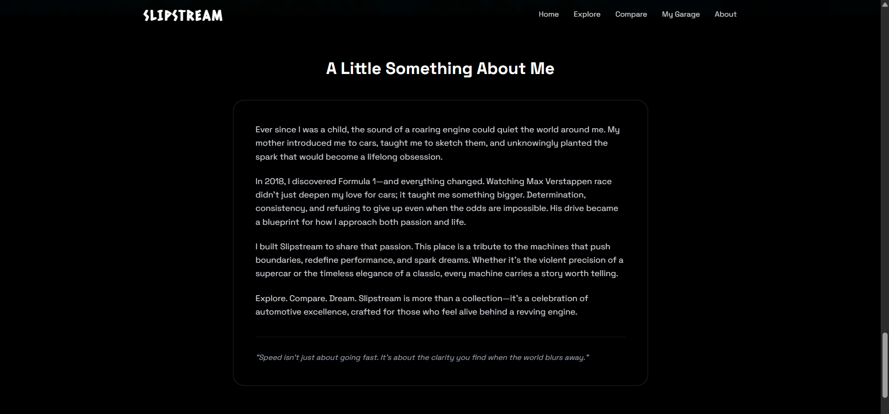
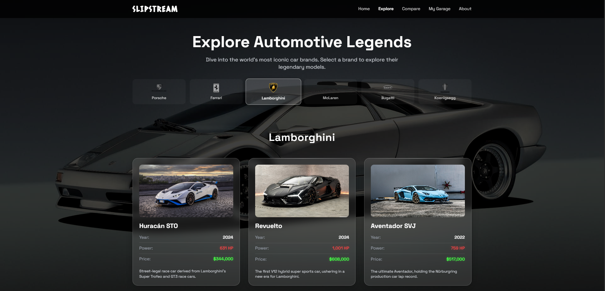
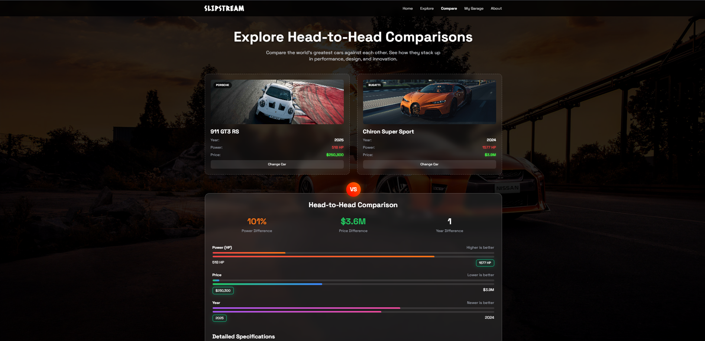
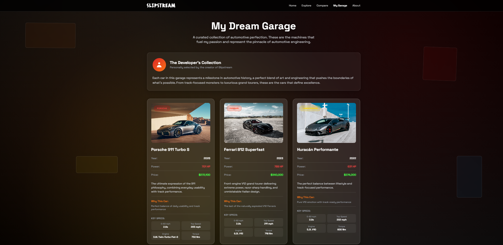

# 🏎️ Slipstream  
*A sleek, minimalist car-exploration experience inspired by speed, design, and motorsport.*

🔗 **Live Site:** https://slipstream17.netlify.app

---

## ✨ About the Project

**Slipstream** is a frontend-only web project built to celebrate automotive excellence.  
It blends a cinematic visual style with a clean, modern UI to let users explore legendary cars, compare performance icons, and step inside a personally curated dream garage.

This project is driven by passion — inspired by Formula 1, performance engineering, and the relentless pursuit of speed and precision.

---

## 🚀 Features

- **Cinematic landing experience** with a Huracán-inspired hero section  
- **Explore Page** — browse iconic cars from legendary manufacturers  
- **Compare Page** — head-to-head comparison of performance titans  
- **My Dream Garage** — a personal showcase of hand-picked automotive icons  
- **Motorsport-inspired UI** with dark themes, glassmorphism, and subtle motion  
- Fully **responsive design** across devices  

---

## 🛠️ Tech Stack

- **HTML5**
- **Tailwind CSS**
- **Vanilla JavaScript**
- **Netlify** (deployment)

---

## 📁 Project Structure
slipstream/
│
├── index.html # Landing page
├── explore.html # Explore cars by brand
├── compare.html # Compare two cars
├── garage.html # My Dream Garage (personal showcase)
│
└── assets/
├── css/
├── js/
└── img/

---

## 🎨 Design Philosophy

Slipstream focuses on:
- Minimalism over clutter  
- Strong typography and spacing  
- Cinematic imagery  
- Subtle micro-interactions  
- A balance between performance data and emotional storytelling  

---

## 🧠 Inspiration

- Formula 1 & motorsport culture  
- Automotive design language  
- Modern portfolio websites  
- The belief that **consistency, determination, and passion** drive excellence  

---

## 📸 Screenshots

### Landing Page

### Explore Page

### Compare Page

### My Dream Garage

---

## 📌 Future Improvements

- Enhanced animations and scroll reveals  
- Performance optimizations  
- Expanded car dataset  
- Accessibility refinements  

---

## 👤 Author

Built with passion by **Siddhesh Khankhoje**  
If you love cars, design, or clean UI — we already have something in common.

---

## 🏁 Final Note

Slipstream is more than a project.  
It’s a tribute to machines that move us — emotionally and mechanically.

**Explore. Compare. Dream.**
